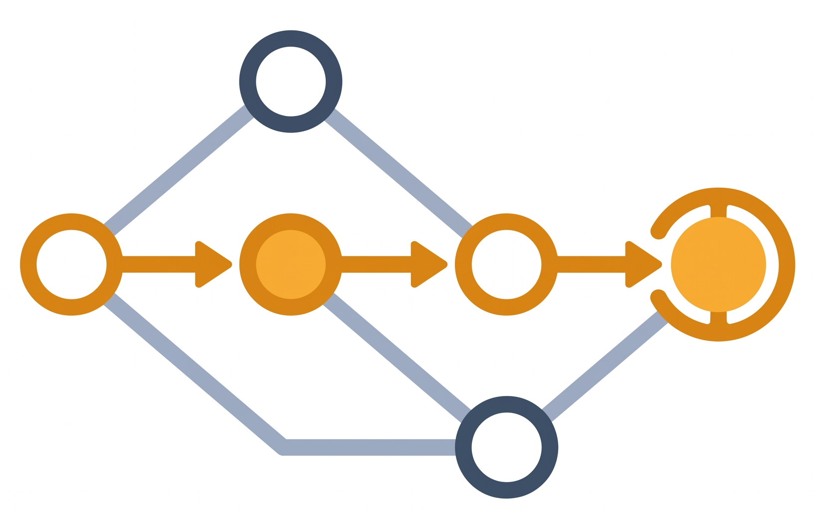

<p align="center">
  
</p>

[](https://discord.gg/46ndug98k)

# Xpsd

One command that decides whether a reported vulnerability is actually
reachable in a given source tree.

Feed it a CVE description, or a whole vulnerability scan report, and it runs
an LLM-driven reachability analysis over your code, then writes structured
verdicts, markdown reports, and SARIF that GitHub code scanning reads.

To keep the cost low, the agent does not read your repository into the model's context. 
It works through a toolset instead: ast-grep for structural code navigation,
OSV.dev lookups and page rendering to pull the advisory and the fixing commit;
and dependency fetching to bring a pinned upstream version into the sandbox when
the affected component is built rather than vendored.

## GitHub CI integration

The action runs on GitHub Copilot through the workflow's built-in
`GITHUB_TOKEN`. Grant `copilot-requests: write` and there is nothing else to
arrange. Xpsd usage bills to the organization along with the rest of your Copilot
spend.

```yaml
permissions:
  contents: read
  security-events: write
  copilot-requests: write   # the built-in token authenticates Copilot
```

If you would rather bring your own model, `provider-type` and `api-key` switch
the run to Anthropic, OpenAI, or Azure without changing anything else.

## A workflow

```yaml
name: reachability
on:
  workflow_dispatch:
  schedule:
    - cron: "0 6 * * 1"

permissions:
  contents: read
  security-events: write
  copilot-requests: write

jobs:
  reachability:
    runs-on: ubuntu-latest
    steps:
      - uses: actions/checkout@v4
      - uses: anchore/sbom-action@v0
        with: {format: cyclonedx-json, output-file: sbom.cdx.json, upload-artifact: false}

      - uses: anchore/scan-action@v6
        with: {sbom: sbom.cdx.json, output-format: json, output-file: scan.json, fail-build: false}

      - uses: byteray-ai/xpsd@v1
        id: xpsd
        with:
          scan-file: scan.json
          model: gpt-5.3-codex
          min-severity: high
          max-findings: "10"       # cap the analyzed findings, highest severity first
          # min-cvss: "7.0"        # numeric floor instead of the severity band
          # is-remote: "true"      # only findings shown to be network-reachable (AV:N)
          # is-exploited: "true"   # only findings CVSS-BT lists as exploited
          # max-cycles: "30"       # tool-call budget per finding
          # max-tokens: "150000"   # token budget per finding; first ceiling hit wins
          # fail-on: reachable     # fail the step when something is reachable

      - uses: github/codeql-action/upload-sarif@v3
        if: always()
        with:
          sarif_file: ${{ steps.xpsd.outputs.sarif-file }}
          category: xpsd-reachability
```

Swap the scanner for whichever one you already run. Xpsd auto-detects the
report format:

| Producer | Format |
|----------|--------|
| [Grype](https://github.com/anchore/grype) | `grype -o json`, or SARIF |
| [Trivy](https://github.com/aquasecurity/trivy) | `trivy -f json`, or SARIF |
| [OSV-Scanner](https://github.com/google/osv-scanner) | `--format json` |
| [Snyk](https://snyk.io) | `snyk test --json`, single or `--all-projects` |
| any SARIF producer | SARIF 2.1.0 |

## What lands in the Security tab

| Verdict | Alert | Severity |
|---------|-------|----------|
| reachable (medium/high confidence) | error | from CVSS |
| reachable (low confidence), uncertain, analysis failed | warning, needs manual review | from CVSS |
| not reachable | note, informational | lowered to low |

A ruled-out finding is filed as low rather than keeping its CVSS rating, because
the score describes the vulnerability and not the risk it poses to your code. A
critical that nothing can reach is what buries the one that can. The real score
stays in the alert, along with the reasoning and the evidence.

Each alert carries the model's rationale, the call path from entry point to
vulnerable use, and evidence links into the implicated source lines. Re-runs
refresh the same alerts in place, and findings that disappear from a later
upload close automatically.

Cost is per finding, one agentic session each, so filtering is how you keep a
run small: `min-severity`, `min-cvss`, `max-findings`, and `only` select what to
look at, while `is-remote` keeps only findings shown to be network-reachable (CVSS
`AV:N`) and `is-exploited` keeps only those the CVSS-BT dataset lists as
exploited. Both need positive evidence, so a finding they cannot confirm is
dropped. `fail-on` turns a reachable verdict into a failed step when you want the
build gated.

Reachability also depends on facts that are not in the code, like what actually
gets compiled or what is exposed to a network. The `guidance` input passes
those in as ground truth for the analysis.

## Docs

- [docs/arch.md](docs/arch.md): How Xpsd works.
- [docs/github-actions.md](docs/github-actions.md): workflow integration, every
  input and output, alert semantics, troubleshooting.
- [docs/usage.md](docs/usage.md): the CLI, both modes, filtering, providers,
  verdict schema, and flag.
- [docs/build.md](docs/build.md): building the image and native builds.

## Contributing and security

Bug reports and pull requests are welcome; see
[CONTRIBUTING.md](CONTRIBUTING.md). Report vulnerabilities privately as
described in [SECURITY.md](SECURITY.md), which also documents the threat model
and known limitations.

## Community and support

For community discussion, setup help, and general questions, join our
[Discord server](https://discord.gg/NKxz6rvAc).

For project work that should stay discoverable and actionable on GitHub, please use:

- [GitHub Issues](../../issues) for bug reports and feature requests
- [Pull Requests](../../pulls) for proposed code changes
- [SECURITY.md](SECURITY.md) for responsible disclosure of vulnerabilities
- [CONTRIBUTING.md](CONTRIBUTING.md) for contribution guidelines


## License

Apache License 2.0, see [LICENSE](LICENSE). Copyright 2026 ByteRay Ltd.
