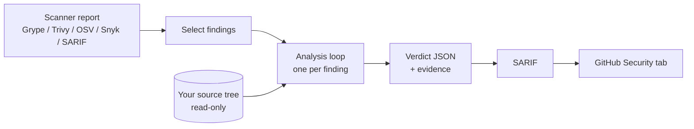
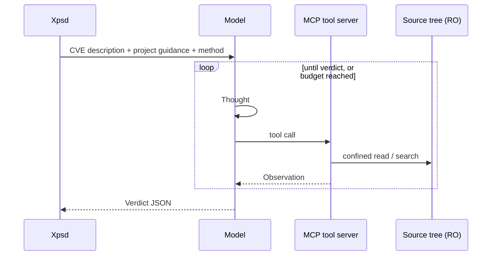
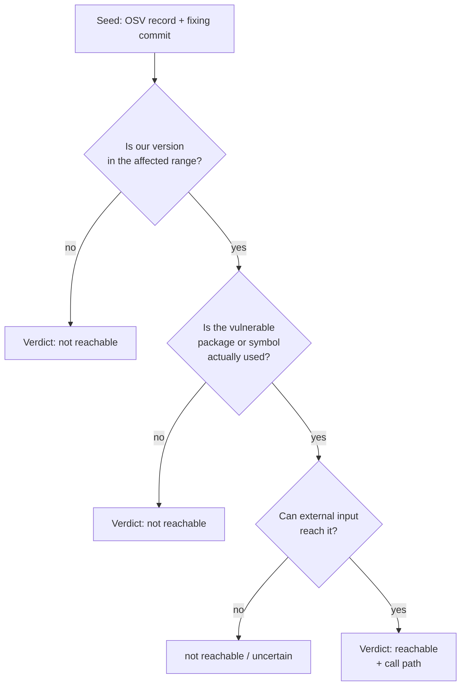
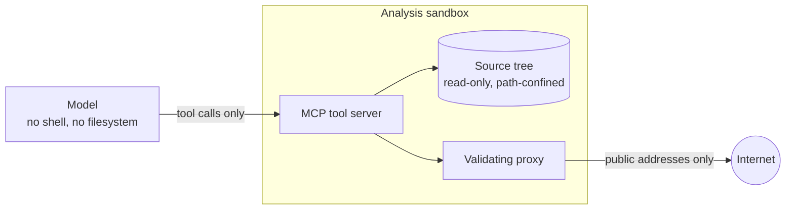

# How Xpsd works

Xpsd answers one question per vulnerability: can attacker-controlled input
reach this vulnerable code, in this repository?

A scanner tells you a vulnerable package version is present. It cannot tell you
whether the vulnerable function is ever called. Xpsd closes that gap by giving a
language model a set of read-only code-analysis tools and making it produce a
structured verdict backed by file and line evidence.

## End to end

## Inside one analysis

Each finding gets its own agent session. The model cannot run shell commands or
touch the filesystem; every fact it learns comes from a tool call.

The loop is a ReAct cycle: the model states what it wants to learn, calls one
tool, then states what the result implies. Xpsd enforces the shape, truncates
oversized results, blocks repeat calls, and stops the loop when a budget is
reached.

The prompt makes the model work cheapest-first, and stop as soon as an answer is
settled:

Most findings exit at the first or second gate, so a run costs far less than the
worst case suggests.

When the affected component is not vendored in the tree, the model recovers the
upstream repo and pinned tag from the build files, fetches that exact version
into the sandbox, and analyzes it with the same tools.

## What the model can touch

Three boundaries enforce this:

| Boundary | Enforcement |
|----------|-------------|
| Source access | Every path is confined to the source root; symlinks pointing outside resolve back to the root. The tree is mounted read-only. |
| Outbound network | Web and dependency fetches go through a loopback proxy that resolves each host once and dials only globally routable addresses, which closes SSRF, redirect chains, and DNS rebinding. |
| Code execution | There is none by default. The one tool that executes code, `run_python`, is off unless explicitly enabled. |

The analyzed source, the advisory text, and any fetched page all count as
untrusted input. The boundaries above stop that content from abusing the tools,
but they cannot stop it from biasing the verdict. [SECURITY.md](../SECURITY.md)
covers the threat model and that limitation.

## Components

| Piece | Job |
|-------|-----|
| [cmd/xpsd](../cmd/xpsd) | Parses reports, runs the selection pipeline, drives the agent loop, writes verdicts and SARIF |
| [tools/mcp-server](../tools/mcp-server) | Serves the analysis tools and enforces path confinement and the network proxy |
| [tools/web-fetcher](../tools/web-fetcher) | Renders advisory pages to markdown, validating every request and response address |
| Copilot CLI | Talks to the model. Bundled and pinned, so the workflow's built-in token is the only credential needed |

Xpsd registers the tool set with the model in-process and proxies each call to
the MCP server, rather than asking the CLI to load an MCP server itself. That
keeps the tool names the model sees identical in every environment.

Build details are in [build.md](build.md); the Action is in
[github-actions.md](github-actions.md).
